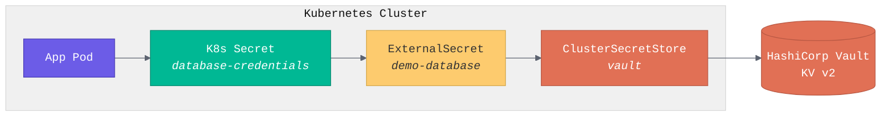
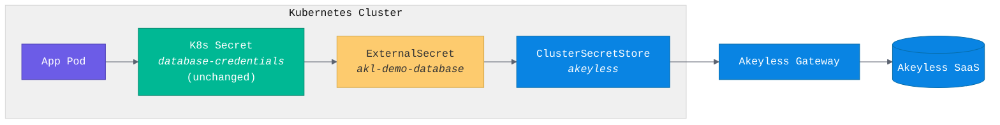
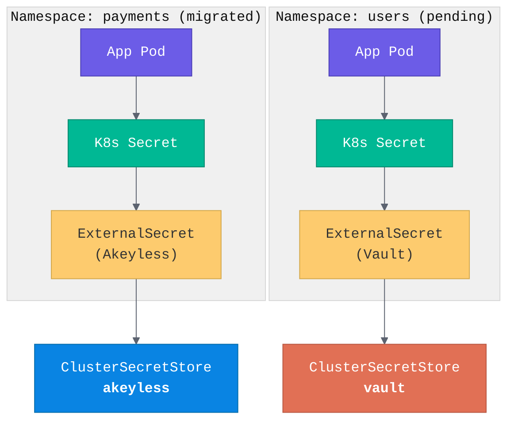
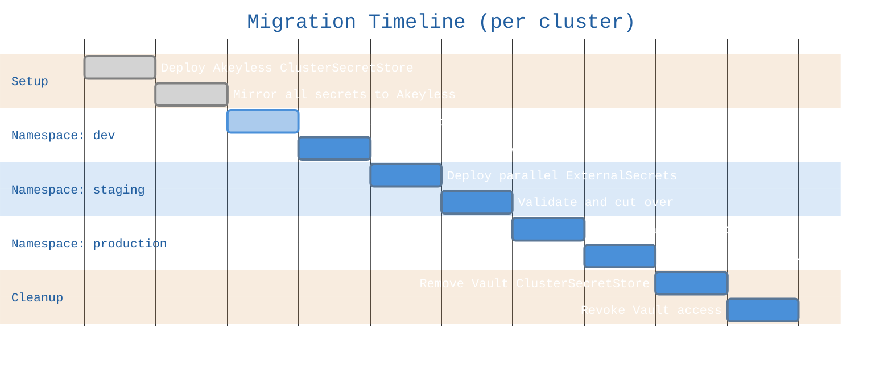

# ESO Migration: Vault to Akeyless

Migrate External Secrets Operator (ESO) from HashiCorp Vault to Akeyless with zero application downtime. The app deployment YAML never changes. Only the ExternalSecret and ClusterSecretStore CRs are modified.

## Architecture

### Before: Vault as secret backend



### After: Akeyless as secret backend



### During migration: both backends active



## Prerequisites

- [ ] Kubernetes cluster with ESO already installed
- [ ] Vault running and accessible from the cluster (current state)
- [ ] Akeyless Gateway deployed and accessible from the cluster
- [ ] Akeyless auth method configured (GCP, AWS IAM, Azure AD, or API key)
- [ ] `kubectl` access to the cluster
- [ ] `jq` and `python3` available (used by helper scripts)

### Install ESO (if not already present)

```bash
helm repo add external-secrets https://charts.external-secrets.io
helm install external-secrets external-secrets/external-secrets \
  -n external-secrets --create-namespace --set installCRDs=true --wait
```

## Secret Path Mapping

Both Vault KV v2 and Akeyless store grouped key/value pairs per path. The ExternalSecret structure is nearly identical between the two. The only change is the key path prefix.

| Vault KV v2 | Akeyless | Change |
|---|---|---|
| `key: demo-app/database` | `key: /demo-app/database` | Add `/` prefix |
| `property: host` | `property: host` | No change |
| `property: port` | `property: port` | No change |

**Vault ExternalSecret:**
```yaml
- secretKey: host
  remoteRef:
    key: demo-app/database        # Vault KV path
    property: host                 # Key within the KV entry
```

**Akeyless ExternalSecret:**
```yaml
- secretKey: host
  remoteRef:
    key: /demo-app/database       # Same path with / prefix
    property: host                 # Same property extraction
```

> Akeyless static secrets store a single string value. To use `property` extraction, store the
> value as a JSON object: `{"host":"10.0.0.1","port":"5432","username":"app","password":"..."}`.
> The `mirror-secrets-to-akeyless.sh` script does this automatically when reading from Vault.

## Pre-Migration Checklist

Run before starting any migration work.

- [ ] **Inventory**: Run `bash scripts/inventory.sh` to scan all Vault-backed ExternalSecrets
- [ ] **Gateway reachable**: Confirm the Akeyless Gateway is accessible from the cluster
  ```bash
  kubectl run test --image=curlimages/curl --rm -it --restart=Never -- \
    curl -sf https://your-gateway/api/v2/gateway-get-k8s-auth-config
  ```
- [ ] **Auth works**: Verify the auth method works from inside a pod
  ```bash
  # For GCP auth, verify pods can reach the metadata service
  kubectl run test --image=curlimages/curl --rm -it --restart=Never -- \
    curl -sf "http://metadata.google.internal/computeMetadata/v1/instance/service-accounts/default/email" \
    -H "Metadata-Flavor: Google"
  ```
- [ ] **Secrets mirrored**: All Vault secrets have been copied to Akeyless
- [ ] **Rollback plan**: Team knows how to revert (see Rollback section)
- [ ] **Maintenance window**: Communicate the migration window to stakeholders

## Migration Steps

### Step 1: Inventory

Scan the cluster and auto-generate Akeyless ExternalSecret YAMLs from existing Vault ones:

```bash
# Print inventory and generated YAMLs to stdout
bash scripts/inventory.sh

# Generate YAML files per namespace
bash scripts/inventory.sh -o manifests/generated

# Filter by namespace
bash scripts/inventory.sh -n payments
```

### Step 2: Mirror secrets to Akeyless

Copy every Vault secret to Akeyless as a JSON-valued static secret:

```bash
cp .env.example .env   # fill in VAULT_ADDR, VAULT_TOKEN
export AKEYLESS_TOKEN=$(akeyless auth --access-id p-xxx --access-type gcp -o json | jq -r .token)
bash scripts/mirror-secrets-to-akeyless.sh
```

### Step 3: Add Akeyless ClusterSecretStore

Deploy alongside the existing Vault store. Both run in parallel.

```bash
# Create auth secret (edit manifests/03-eso-akeyless/akeyless-auth-secret.yaml first)
kubectl apply -f manifests/03-eso-akeyless/akeyless-auth-secret.yaml

# Create Akeyless ClusterSecretStore (edit gateway URL first)
kubectl apply -f manifests/03-eso-akeyless/clustersecretstore-akeyless.yaml

# Verify both stores are Ready
kubectl get clustersecretstores
```

Expected output:
```
NAME       STATUS   READY
vault      Valid    True
akeyless   Valid    True
```

### Step 4: Deploy parallel Akeyless ExternalSecrets

Choose your cutover strategy:

#### Option A: Validate-then-switch (recommended for first namespace)

Creates temporary `-akl` suffixed K8s secrets for comparison. Vault secrets remain untouched.

```bash
kubectl apply -f manifests/04-migration/externalsecrets-akeyless-parallel.yaml

# Validate both sources match
bash scripts/validate-migration.sh demo
```

Then cut over:

```bash
# Remove Vault ExternalSecrets
kubectl delete externalsecret demo-database demo-api-keys demo-config -n demo

# Switch Akeyless ExternalSecrets to target original secret names
kubectl apply -f manifests/04-migration/externalsecrets-akeyless-final.yaml

# Restart app to pick up new secrets
kubectl rollout restart deployment/demo-app -n demo
```

#### Option B: Zero-downtime merge (recommended for production)

Uses `creationPolicy: Merge` to write directly into the existing K8s secrets. No temporary secrets, no deletion gap.

```bash
# Akeyless writes into the same K8s secrets Vault created
kubectl apply -f manifests/04-migration/externalsecrets-akeyless-merge.yaml

# Verify secrets still resolve
bash scripts/smoketest.sh demo

# Remove Vault ExternalSecrets (K8s secrets persist, Merge skips ownerRef)
kubectl delete externalsecret demo-database demo-api-keys demo-config -n demo

# No app restart needed. Secrets never disappeared.
```

### Step 5: Smoke test

```bash
bash scripts/smoketest.sh demo
```

Checks:
- ClusterSecretStore is Ready
- All ExternalSecrets show SecretSynced
- K8s secrets exist and have data
- Pods are running and Ready
- Env vars are loaded in pods

### Step 6: Cleanup

```bash
bash manifests/05-cleanup/remove-vault.sh demo
```

This removes:
- Vault ClusterSecretStore
- `vault-eso-auth` ServiceAccount and token Secret

### Step 7: Revoke Vault access

After all namespaces are migrated:

```bash
# Disable the K8s auth role ESO was using
vault delete auth/kubernetes/role/eso-role

# Revoke any outstanding tokens from that role
vault token revoke -mode path auth/kubernetes

# Optionally disable the auth method entirely
vault auth disable kubernetes
```

## Rollback

### Before cutover (Steps 1-3)

Rollback is trivial. Vault ExternalSecrets are still running, app is unaffected.

```bash
# Remove Akeyless ExternalSecrets
kubectl delete externalsecret -n demo -l migration-source=akeyless

# Remove Akeyless ClusterSecretStore
kubectl delete clustersecretstore akeyless
kubectl delete secret akeyless-auth -n external-secrets
```

### After cutover (Steps 4+)

```bash
# Re-create Vault ClusterSecretStore
kubectl apply -f manifests/02-eso-vault/clustersecretstore-vault.yaml

# Re-create Vault ExternalSecrets (recreates the K8s secrets)
kubectl apply -f manifests/02-eso-vault/externalsecrets-vault.yaml

# Remove Akeyless ExternalSecrets
kubectl delete externalsecret -n demo -l migration-source=akeyless

# Restart app
kubectl rollout restart deployment/demo-app -n demo
```

## Namespace-by-Namespace Strategy

This is the recommended approach for production migrations:



1. Both ClusterSecretStores (Vault + Akeyless) exist cluster-wide
2. Each namespace is migrated independently, starting with dev/staging
3. Some namespaces can run on Vault while others run on Akeyless
4. Rollback scope is per-namespace, not cluster-wide
5. Only after all namespaces are migrated do you remove the Vault ClusterSecretStore

### Multi-cluster rollout

For organizations with multiple clusters behind a load balancer:

1. Pick a non-production cluster first
2. Complete the full namespace-by-namespace migration on that cluster
3. Validate for at least one full refresh cycle (check `refreshInterval`)
4. Move to the next cluster
5. Remove Vault access per-cluster as each one completes

## Errors Encountered During Migration

### 1. ESO API version mismatch

**Error:**
```
error: resource mapping not found for name: "vault" namespace: ""
no matches for kind "ClusterSecretStore" in version "external-secrets.io/v1beta1"
```

**Cause:** ESO v0.12+ uses `external-secrets.io/v1`. Many online examples still show `v1beta1`.

**Fix:** Check your installed version:
```bash
kubectl api-resources | grep externalsecret
```

### 2. Vault K8s auth needs a long-lived SA token

**Error:** ESO ClusterSecretStore shows `SecretRef` error or Vault returns 403.

**Cause:** Kubernetes 1.24+ no longer auto-creates long-lived tokens for service accounts. ESO needs a persistent token.

**Fix:** Explicitly create a `kubernetes.io/service-account-token` Secret:
```yaml
apiVersion: v1
kind: Secret
metadata:
  name: vault-eso-auth-token
  annotations:
    kubernetes.io/service-account.name: vault-eso-auth
type: kubernetes.io/service-account-token
```

### 3. One-secret-per-field anti-pattern in Akeyless

**Error:** Migration creates dozens of individual Akeyless secrets like `/app/database/host`, `/app/database/port`, `/app/database/password`.

**Cause:** Treating each Vault KV property as a separate Akeyless secret path. This does not match how secrets are modeled in either system.

**Fix:** Store grouped values as a single JSON-valued Akeyless secret. The `property` field on `remoteRef` extracts individual keys from the JSON, same as with Vault KV v2:
```yaml
remoteRef:
  key: /demo-app/database       # Single secret, JSON value
  property: host                 # Extract "host" from the JSON
```

### 4. GCP metadata service unreachable from pods

**Error:** Akeyless ClusterSecretStore fails to validate with GCP auth.

**Cause:** On non-GKE clusters (e.g. microk8s on a GCP VM), pods may not reach the metadata service at `169.254.169.254`.

**Fix:** Test pod-level access first:
```bash
kubectl run test --image=curlimages/curl --rm -it --restart=Never -- \
  curl -sf "http://metadata.google.internal/computeMetadata/v1/instance/service-accounts/default/email" \
  -H "Metadata-Flavor: Google"
```
On microk8s, enabling the `host-access` addon can help. On GKE, this works out of the box.

### 5. Akeyless ClusterSecretStore shows ReadOnly

**Symptom:** `kubectl get clustersecretstore akeyless` shows `Capabilities: ReadOnly`.

**Cause:** Expected behavior. The Akeyless ESO provider only supports read operations. Push secrets to Akeyless via the API, CLI, or the `mirror-secrets-to-akeyless.sh` script.

### 6. Secret disappears briefly during cutover

**Symptom:** Deleting a Vault ExternalSecret also deletes the K8s Secret it created. Pods that restart during this window fail to mount the secret.

**Cause:** `creationPolicy: Owner` (the default) sets an `ownerReference` on the K8s Secret. Kubernetes garbage-collects it when the ExternalSecret is deleted.

**Fix:** Use `creationPolicy: Merge` instead (see `externalsecrets-akeyless-merge.yaml`). Merge writes into an existing secret without setting ownerRef, so deleting the Vault ExternalSecret does not delete the K8s Secret.

## Repo Structure

```
manifests/
  01-vault-setup/           # Vault K8s auth, service account, token
  02-eso-vault/              # Vault ClusterSecretStore, ExternalSecrets, demo app
  03-eso-akeyless/           # Akeyless auth secret, ClusterSecretStore
  04-migration/              # Parallel, final, and merge cutover manifests
  05-cleanup/                # Vault removal script
scripts/
  inventory.sh               # Scan cluster, generate Akeyless ExternalSecret YAMLs
  mirror-secrets-to-akeyless.sh  # Copy Vault KV secrets to Akeyless (JSON format)
  validate-migration.sh      # Compare Vault vs Akeyless K8s secret values
  smoketest.sh               # Post-cutover health check
.env.example                 # Configuration template
```

## Tested Environment

- Kubernetes: microk8s v1.33 on GCP VM (Ubuntu 24.04)
- ESO: external-secrets (Helm, latest, `external-secrets.io/v1` API)
- Vault: 1.21.2 (KV v2)
- Akeyless Gateway: 4.48.0
- Akeyless auth: GCP workload identity
